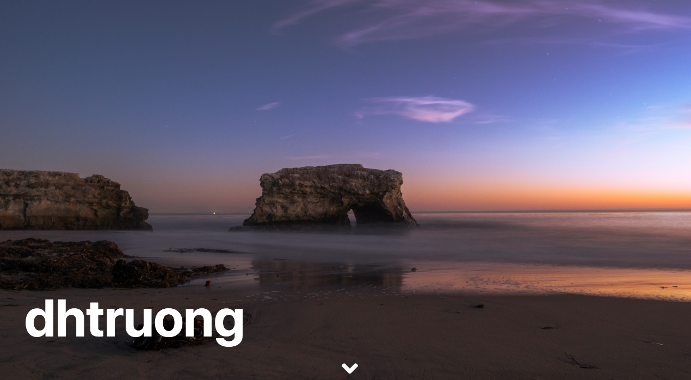

<h1 align='center'>Photo Portfolio</h1>

Live Demo: https://duyhtruong.github.io/photo-portfolio

 
 

					Photo portfolio is a web app created to showcase my personal photography. When entering the webpage, users are greeted with a large full-screen 
					carousel of images. Just below the carousel is an instagram-like grid display of more photos
					with a functioning filter tab. The website is structured using HTML, styled using CSS/Bootstrap, and filter function incorporated using jQuery.

